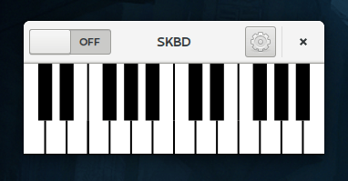

A small virtual piano keyboard for [JACK](http://www.jackaudio.org/),
that fits nicely on your [elementary](https://elementary.io/)
desktop. By Skrylar.

Bitcoins accepted for this project at:
1QBvAuynS3bxr9HYLCt3PUuztEUfhcEiyh

Main program under the GPL2. Keyboard widget is itself available under
MIT.

# Recommended Building Instructions
You will need [Meson](http://mesonbuild.com/) and
[Ninja](https://ninja-build.org/). Then, just simply run:

    mkdir build
    mesonbuild.py . build
    ninja -C build

This is the fastest way to get going, and the one used for
development.

